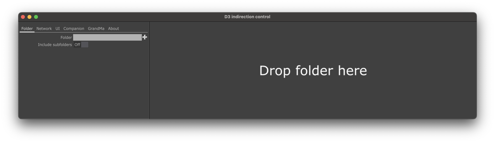

# D3 indirection control

Easily control your osc indirection layer in disguise.

## Touchdesigner version

* 099 2022.25370

## OS support

* Windows 10
* macOs

## Parameters

### Folder

#### Folder
Select folder which you want to control

#### Subfolders
Option to include all subfolders in selected folder

### Network

#### Active
Active sending osc command

#### IP address
Set ip address of your d3 machine

#### Osc port
Set osc port

#### Local IP
Select or set ip address of your local machine

#### Osc path
Set indirection osc path for commands which you made in d3 indirection layer

### UI

#### Buttons

Either set width and height of your buttons or just press auto fit width and auto fit height to automatically adjust buttons size to the window.

Also, you can easily unpin window with buttons either on the same monitor or an external monitor just press button open as separate window.

### Companion

If you have Elgato StreamDeck and you want to use him instead of use this application you can easily export config file for [Bitfocus Companion](https://github.com/bitfocus/companion) with already predefined buttons.

Before exporting config file set text color and background color and adjust text alignment with size. Press "Export config" button and save config at your PC.

Go to Companion and launch UI, go to import/export tab and import your saved config.

It'll add new OSC Generic connection in Companion and will create buttons with names of your files.

NOTE: If osc connection doesn't work go to connection tab and just disable and enable it again.

